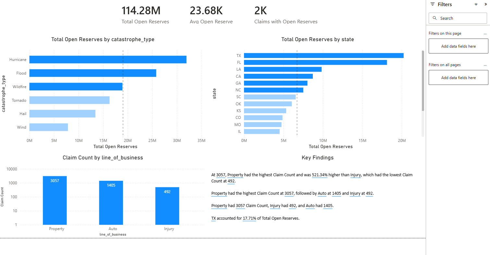
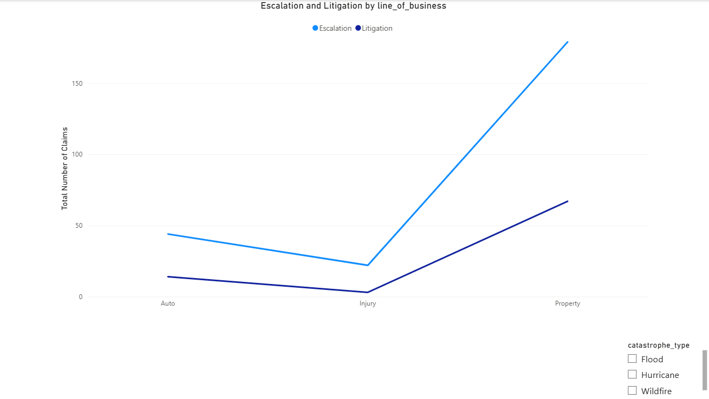
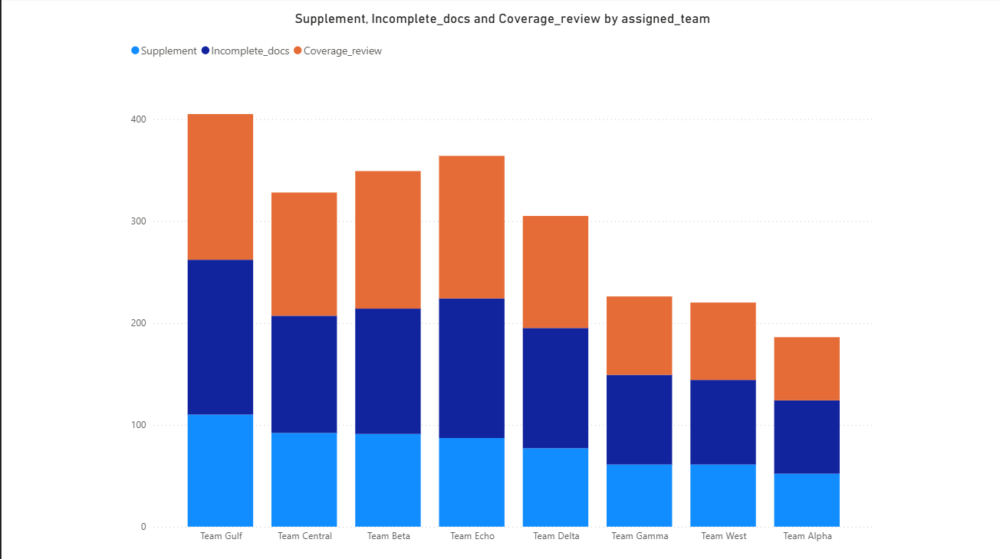
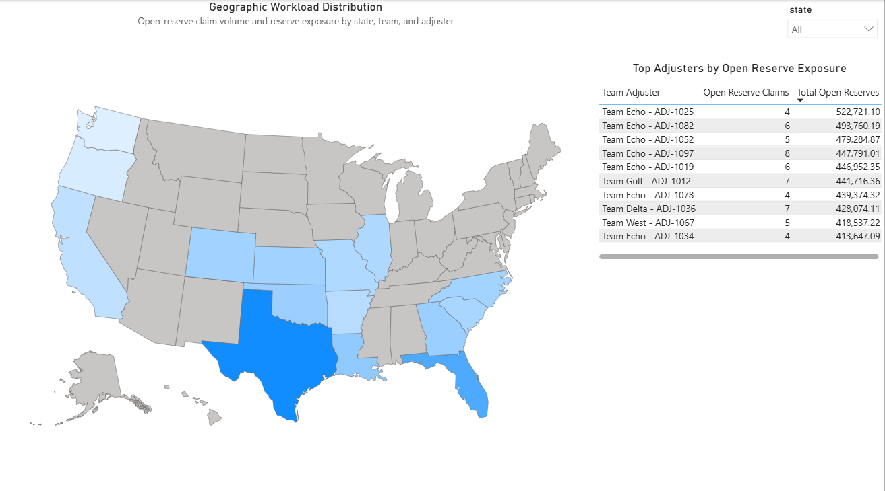

# Catastrophe Claims Open Reserve Analysis

SQL and Power BI analysis of catastrophe claims, open reserve pressure, operational complexity, and adjuster exposure.

## Project Overview

This project analyzes catastrophe claim data to identify where open claim reserves are building up, which claim segments show higher operational complexity, and how open-reserve exposure is distributed across teams and adjusters.

The analysis was completed using SQL in BigQuery for cleaning, validation, and analysis, with Power BI used to build the final interactive dashboard.

## Business Problem

Leadership observed a persistent buildup of open claim reserves after catastrophe events. The goal of this project was to determine:

- Which catastrophe claim segments are driving open reserve pressure
- Which states and lines of business have the highest reserve exposure
- Whether operational complexity indicators such as supplements, escalations, litigation, and coverage review appear connected to open reserves
- Whether open-reserve workload is concentrated across specific teams or adjusters

## Tools Used

- SQL / BigQuery
- Power BI
- Excel
- GitHub

## Dashboard Pages

### 1. Reserve Pressure

Shows total open reserves, open-reserve claim volume, average reserve severity, and reserve concentration by catastrophe type and state.

### 2. Operational Complexity

Reviews operational indicators such as escalation, litigation, supplements, coverage review, documentation issues, and activity count.

### 3. Estimating

Focuses on estimating and repair-process indicators connected to open-reserve claim handling.

### 4. Adjuster Exposure

Shows geographic workload distribution and identifies top adjuster/team combinations by open-reserve exposure.

## Key Findings

- Open-reserve pressure is concentrated most heavily in Hurricane, Flood, and Wildfire claims.
- Hurricane claims produced the highest total open reserve exposure.
- Wildfire claims showed higher average reserve severity despite lower claim volume.
- Hail had a high number of open-reserve claims but lower average reserve severity, making it more of a workload-volume issue than a reserve-severity issue.
- Operational complexity indicators such as supplements, escalations, litigation, and coverage review helped explain why certain claim segments remained open.
- Team and adjuster analysis showed that open-reserve exposure was not evenly distributed across the claim organization.

## Recommendations

- Prioritize review of high-reserve catastrophe segments, especially Hurricane, Flood, and Wildfire claims.
- Monitor states and lines of business with the highest open-reserve exposure.
- Review claims with supplements, escalation activity, litigation indicators, or coverage review for earlier triage.
- Evaluate team and adjuster workload distribution to determine whether regional assignment strategy or claim complexity balancing should be adjusted.
- Use the dashboard as an operational review tool for identifying reserve pressure, complexity patterns, and workload concentration.

## SQL Files

The SQL folder includes:

- `01_clean_master_claims.sql` - Cleans and standardizes the master claims table.
- `02_clean_claim_activity.sql` - Cleans and standardizes the claim activity table.
- `03_create_claim_profile_final.sql` - Creates the final one-row-per-claim reporting table for Power BI.
- `04_validation_queries.sql` - Validates final table counts, reserve totals, and key dashboard metrics.
- `05_analysis_queries.sql` - Contains analysis queries used to support dashboard findings.

## Files Included

- Final Power BI dashboard file
- Dashboard screenshots
- SQL cleaning scripts
- SQL validation queries
- SQL analysis queries

## Notes

This is a portfolio project using a structured claims dataset for analytics practice. No real customer, claimant, or confidential company data is included.
